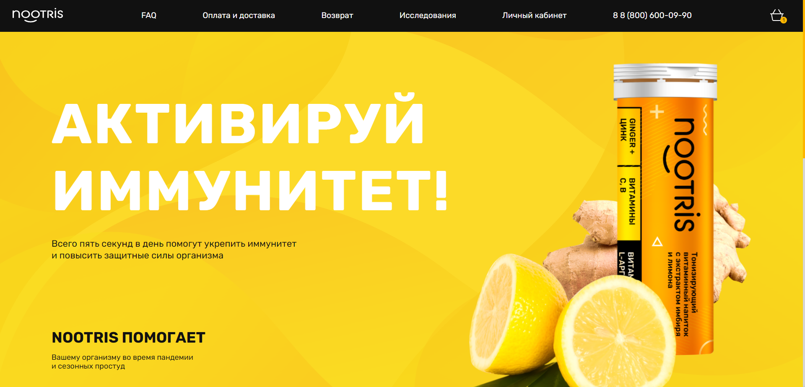
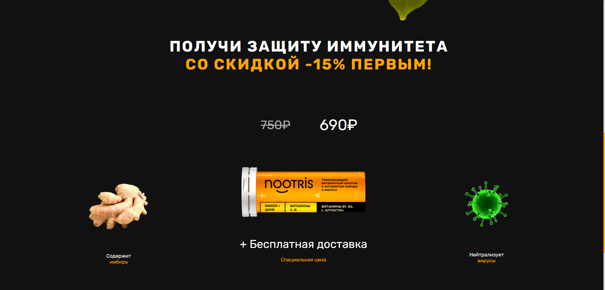
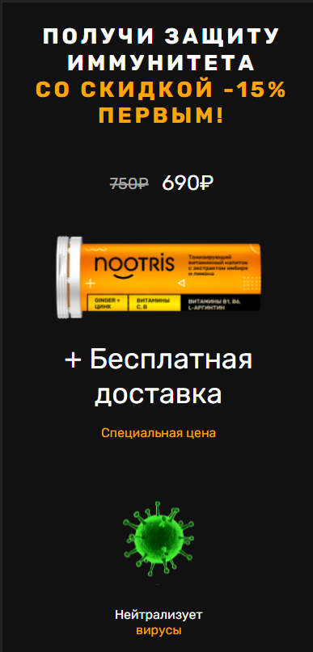

<h1 align='center'>WillSkill - Test Landing</h1>
<h3 align='center'>Test responsive landing with React, Styled Components and TypeScript (Animation in another branch) 🎨</h3>
 

 

<h3>Simple version - https://ws-test-landing.vercel.app/</h3>
<h3>Animated version -</h3>

<h2 align='center'> Screenshots:</h2>

